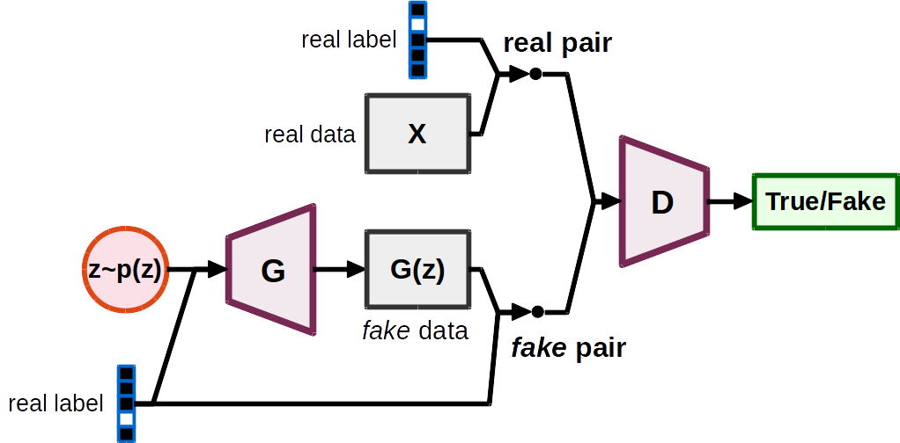

# Background

## Generative Adversarial Network (GAN)

A GAN consists of two networks: a _generator_ network 𝐺 and a discriminator
network 𝐷 [1]. The generator 𝐺 takes as input a random noise 𝐳 sampled from a
prior distribution 𝑝𝐳 and output a fake sample 𝐺(𝐳). The
discriminator 𝐷 takes as input either a sample drawn from real data or generated
by the generator and outputs a scalar indicating its authenticity.

The adversarial setting goes like this:

- __𝐷 tries to tell the fake samples from samples data__
- __𝐺 tries to fool 𝐷 (to make 𝐷 misclassify the generated, fake samples as
  real ones)__

In general, most GAN loss functions proposed in the literature take the
following form:

𝑚𝑎𝑥𝐷 𝔼𝐱~𝑝𝑑 [ 𝑓(𝐷(𝐱)) ] +
𝔼𝐱~𝑝𝑔 [ 𝑔(𝐷(𝐱)) ]

𝑚𝑖𝑛𝐺 𝔼𝐱~𝑝𝑔[ ℎ(_D_(𝐱)) ]

Here, 𝑓, 𝑔 and ℎ are real functions defined on the data space (i.e., 𝒳 → ℝ),
and we will refer to them as the ___component functions___.

## Conditional Generative Adversarial Networks (CGAN)

In a conditional GAN (CGAN) [2], both the generator 𝐺 and the discriminator 𝐷
are now conditioned on some variable 𝐲. Typical (𝐱, 𝐲) pairs include (data,
labels), (data, tags), (image, image).

## Gradient penalties

As the discriminator is often found to be too strong to provide reliable
gradients to the generator, one regularization approach is to use some gradient
penalties to constrain the modeling capability of the discriminator.

Most gradient penalties proposed in the literature take the following form:

𝜆 𝔼𝐱~𝑝𝐱 [ 𝑅( ||∇𝐱𝐱|| ) ]

Here, the _penalty weight_ 𝜆 ∈ ℝ is a pre-defined constant, and 𝑅(⋅) is a real
function. The distribution 𝑝𝐱 defines where the gradient penalties
are enforced. Note that this term will be added to the loss function as a
_regularization term_ for the discriminator.

Here are some common gradient penalties and their 𝑝𝐱 and 𝑅(⋅).

| gradient penalty type                | 𝑝𝐱 | 𝑅(𝑥) |
|--------------------------------------|:-------------:|:----:|
| coupled gradient penalties [4]       | 𝑝𝑑 + 𝑈[0, 1] (𝑝𝑔 − 𝑝𝑑) | (𝑥 − 𝑘)2 or 𝑚𝑎𝑥(𝑥, 𝑘) |
| local gradient penalties [5]         | 𝑝𝑑 + 𝑐 𝑁[0, 𝐼] | (𝑥 − 𝑘)2 or 𝑚𝑎𝑥(𝑥, 𝑘) |
| R1 gradient penalties [6] | 𝑝𝑑 | 𝑥    |
| R2 gradient penalties [6] | 𝑝𝑔 | 𝑥    |

## Spectral normalization

Spectral normalization is another regularization approach for GANs. It
normalizes the spectral norm of each layer in a neural network to enforce the
Lipschitz constraints. While the gradient penalties impose a local
regularization, the spectral normalization impose a global regularization on the
discriminator.

## References

[1] Ian J. Goodfellow, Jean Pouget-Abadie, Mehdi Mirza, Bing Xu, David
    Warde-Farley, Sherjil Ozair, Aaron Courville, and Yoshua Bengio,
    "Generative Adversarial Networks,"
    in _Proc. NeurIPS_, 2014.

[2] Mehdi Mirza and Simon Osindero,
    "Conditional Generative Adversarial Nets,"
    _arXiv preprint, arXiv:1411.1784_, 2014.

[3] Martin Arjovsky, Soumith Chintala, and Léon Bottou,
    "Wasserstein Generative Adversarial Networks,"
    in _Proc. ICML_, 2017.

[4] Ishaan Gulrajani, Faruk Ahmed, Martin Arjovsky, Vincent Dumoulin, and
    Aaron Courville,
    "Improved Training of Wasserstein GANs,"
    in _Proc. NeurIPS_, 2017.

[5] Naveen Kodali, Jacob Abernethy, James Hays, and Zsolt Kira,
    "On Convergence and Stability of GANs,"
    _arXiv preprint, arXiv:1705.07215_, 2017.

[6] Lars Mescheder, Andreas Geiger, and Sebastian Nowozin,
    "Which training methods for GANs do actually converge?"
    in _Proc. ICML_, 2018.

[7] Takeru Miyato, Toshiki Kataoka, Masanori Koyama, and Yuichi Yoshida,
    "Spectral Normalization for Generative Adversarial Networks,"
    in _Proc. ICLR_, 2018.
