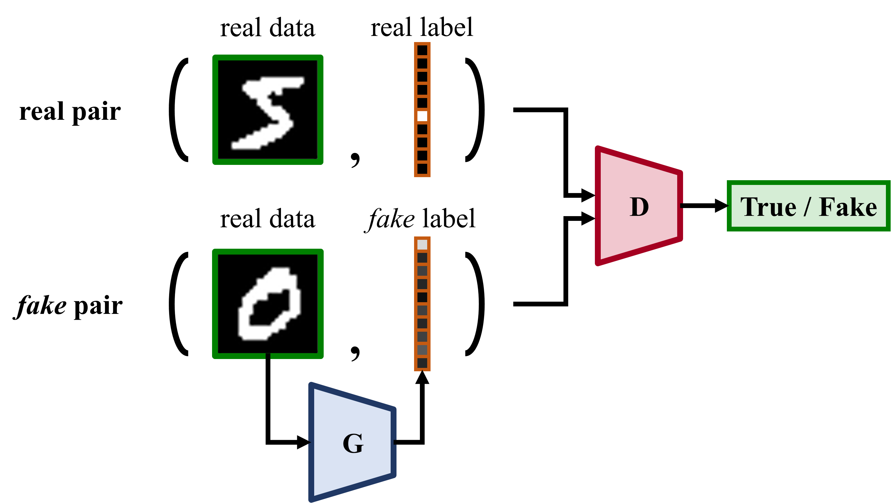

# MNIST Digit Classification with DANs in TensorFlow

In this project, we train a discriminative adversarial network (DAN) to classify
MNIST handwritten digit. We also experimentally compare different normalization
approaches, activation functions and training objectives. The experimental
results are available [here](results).

## Dicriminative Adversarial Networks (DANs)

The discriminative adversarial network (DAN) is proposed by Mirza _et al._ as a
discriminative framework for learning loss functions for semi-supervised
learning [1]. It is based on the generative adversarial networks (GANs) [1] and
the conditional generative adversarial networks (GANs). However, the generator
now becomes a predictor that take as input an unlabeled data and predict its
label. The discriminator take as input either a real-data-real-label pair
(__x__, __y__) or a real-data-fake-label pair (__x__, G(__x__)) and aim to tell
the fake ones from the real ones.

Unlike a typical traditional supervised training scenario, where we need to pick
a specific surrogate loss function as the objective of the predictor to learn
the distribution _p_(__y__|__x__), in DANs the discriminator provides the
critics for the predictor. Hence, _the generator is not optimizing any specific
form of surrogate loss function_ for the discriminator is being optimized along
the training process.

## Reference

[1] Cicero Nogueira dos Santos, Kahini Wadhawan, and Bowen Zhou,
    "Learning Loss Functions for Semi-supervised Learning via Discriminative
    Adversarial Networks,"
    in _NIPS Workshop on Learning with Limited Labeled Data_, 2017.
